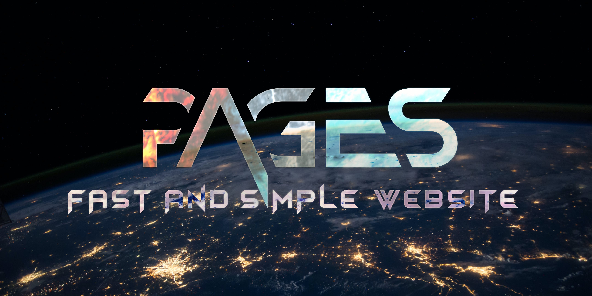

[wtfpl]: http://www.wtfpl.net/about/  
[newton-howard]: https://www.dafont.com/newton-howard.font
[himagsikan]: https://www.dafont.com/himagsikan.font
[unsplash-license]: https://unsplash.com/license
[6lQDFGOB1iw]: https://unsplash.com/photos/6lQDFGOB1iw
[jh2KTqHLMjE]: https://unsplash.com/photos/jh2KTqHLMjE
[OwOyvyqT1vg]: https://unsplash.com/photos/OwOyvyqT1vg
[dkv2CXSoVfs]: https://unsplash.com/photos/dkv2CXSoVfs
[57nMMJhh3ig]: https://unsplash.com/photos/57nMMJhh3ig
[Q1p7bh3SHj8]: https://unsplash.com/photos/Q1p7bh3SHj8
[7bynNtRqu4E]: https://unsplash.com/photos/7bynNtRqu4E
[simple-icons]: https://simpleicons.org/
[youtube-logo]: src/assets/brand-icons/youtube.svg
[youtube-gaming-logo]: src/assets/brand-icons/youtubegaming.svg
[patreon-logo]: src/assets/brand-icons/patreon.svg
[github-logo]: src/assets/brand-icons/github.svg
[discord-logo]: src/assets/brand-icons/discord.svg
[x-logo]: src/assets/brand-icons/x.svg
[twitch-logo]: src/assets/brand-icons/twitch.svg
[pinterest-logo]: src/assets/brand-icons/pinterest.svg
[reddit-logo]: src/assets/brand-icons/reddit.svg
[zenn-logo]: src/assets/brand-icons/zenn.svg
[telegram-logo]: src/assets/brand-icons/telegram.svg
[python-logo]: src/assets/lang-icons/python.svg
[go-logo]: src/assets/lang-icons/go.svg
[lua-logo]: src/assets/lang-icons/lua.svg
[rust-logo]: src/assets/lang-icons/rust.svg
[apache-logo]: src/assets/lang-icons/apache.svg
[astro-logo]: src/assets/lang-icons/astro.svg
[youtube-logo-guideline]: https://www.youtube.com/howyoutubeworks/resources/brand-resources/#logos-icons-and-colors
[patreon-logo-guideline]: https://www.patreon.com/brand
[github-logo-guideline]: https://github.com/logos
[discord-logo-guideline]: https://discord.com/branding
[x-logo-guideline]: https://about.twitter.com/en/who-we-are/brand-toolkit
[pinterest-logo-guideline]: https://business.pinterest.com/en/brand-guidelines
[twitch-logo-guideline]: https://brand.twitch.tv/
[reddit-logo-guideline]: https://www.redditinc.com/brand
[python-logo-guideline]: https://www.python.org/community/logos/
[apache-logo-guideline]: https://www.apache.org/foundation/marks/
[apache-lincense]: https://spdx.org/licenses/Apache-2.0
[rust-logo-guideline]: https://foundation.rust-lang.org/policies/logo-policy-and-media-guide/
[go-logo-guideline]: https://go.dev/blog/go-brand
[cc-by-sa-4.0]: https://spdx.org/licenses/CC-BY-SA-4.0
[lua-logo-guideline]: https://www.lua.org/images/
[auto]: https://docs.astro.build/en/install/auto/
[manual]: https://docs.astro.build/install/manual/
[deepl]: https://www.deepl.com/translator
[google-translator]: https://translate.google.com
[chatgpt]: https://chat.openai.com/
[vscode]: https://code.visualstudio.com/
[stylus]: https://stylus-lang.com/

<picture>
  <source srcset=".github/assets/banner.avif" />
  <source srcset=".github/assets/banner.webp" />
  
</picture>

# [Pages](https://7rs.dev/)  

  **Fast** and **simple design** website  

  [](https://github.com/7rs/pages/blob/main/LICENSE)
  [](https://github.com/7rs/pages/commits/main)
  [](https://github.com/7rs/pages/commits/main)
  [](https://github.com/7rs/pages/issues)
  [](https://github.com/7rs/pages/issues?q=is%3Aissue+is%3Aclosed)

## Features  

- [Open source](https://wikipedia.org/wiki/FLOSS).
- Targeting a score of 90+ on [PageSpeed Insights](https://pagespeed.web.dev/).  
- Compatible with many browsers (FireFox, Chrome, Safari).  
- Supports [dark mode](https://developer.mozilla.org/ja/docs/Web/CSS/@media/prefers-color-scheme).  
- Supports [i18n](https://wikipedia.org/wiki/Internationalization_and_localization) (Japanese and English).  
- Images compressed by [sharp](https://github.com/lovell/sharp).  
- Awesome brand icons from [Simple Icons][simple-icons].  
- Awesome pictures from [Unsplash](https://unsplash.com/).  
- Easy setup with [VSCode][vscode].  
- Using [TypeScript](https://www.typescriptlang.org/).  

## Benchmark (Score)  

## Getting Started  

### Requirement  

  | Package | Version |
  |-|-|
  | [Astro](https://www.npmjs.com/package/astro) |  |
  | [Sharp](https://www.npmjs.com/package/sharp) |  |
  | [Stylus](https://www.npmjs.com/package/stylus) |  |
  | [PostCSS](https://www.npmjs.com/package/postcss) |  |
  | [Svelte](https://www.npmjs.com/package/svelte) |  |  

  Pages assumes Cloudflare Pages, but probably other hosting services be available.
  [Cloudflare Pages](https://pages.cloudflare.com/)  

### Installation  

  These are descriptions of how to do it using a shell.  

#### Clone the pages project  

  ```sh
  git clone git@github.com:7rs/pages.git --depth 1

  # If using HTTPS
  git clone https://github.com/7rs/pages.git --depth 1

  # Navigate to the pages project.
  cd pages
  ```  

  > Create a shallow clone with a history truncated to the specified number of commits.
  > Implies `--single-branch unless` unless `--no-single-branch` is given to fetch the histories near the tips of all branches.
  > If you want to clone submodules shallowly, also pass `--shallow-submodules`.  
  >  
  > [Git - git-clone Documentation](https://git-scm.com/docs/git-clone)  

#### Install dependencies  

  ```sh
  pnpm install

  # If using yarn
  yarn install

  # If using npm
  npm install
  ```  

#### Activate a preview in a browser  

  ```sh
  pnpm run dev

  # If using yarn
  yarn run dev

  # If using npm
  npm run dev
  ```  

### License  

  **Pages** is published under [WTFPL][wtfpl] except for asset files.  
  Licensing information for files is as follows. **Some are not listed.**  

  | Name | Author | License |
  |-|-|-|
  | [Person sitting on top of building during daytime (pfp)][7bynNtRqu4E] | @smnzhu | [Unsplash License][unsplash-license] |
  | [Photo of outer space (Background)][Q1p7bh3SHj8] | @nasa | [Unsplash License][unsplash-license] |
  | [Newton Howard (Banner title)][newton-howard] | 177Studio | No commercial use. |
  | [Close up photo of burning firewood][57nMMJhh3ig] | @edenconstantin0 | [Unsplash License][unsplash-license] |
  | [Red and blue wallpaper][6lQDFGOB1iw] | @pawel_czerwinski | [Unsplash License][unsplash-license] |
  | [A black and white photo of a cross made of ice][dkv2CXSoVfs] | @wistomsin | [Unsplash License][unsplash-license] |
  | [A close up of a wave in the ocean][OwOyvyqT1vg] | @moonshadowpress | [Unsplash License][unsplash-license] |
  | [Himagsikan (Banner description)][himagsikan] | EyeCone | Personal and commercial use. |
  | [Silhouette of trees and purple lightning][jh2KTqHLMjE] | @jeremythomasphoto | [Unsplash License][unsplash-license] |
  | [YouTube logo][youtube-logo] | [Simple Icons][simple-icons] | [Guideline][youtube-logo-guideline] |
  | [Youtube Gaming logo][youtube-gaming-logo] | [Simple Icons][simple-icons] | No information |
  | [Patreon logo][patreon-logo] | [Simple Icons][simple-icons] | [Guideline][patreon-logo-guideline] |
  | [GitHub logo][github-logo] | [Simple Icons][simple-icons] | [Guideline][github-logo-guideline] |
  | [Discord logo][discord-logo] | [Simple Icons][simple-icons] | [Guideline][discord-logo-guideline] |
  | [X logo][x-logo] | [Simple Icons][simple-icons] | [Guideline][x-logo-guideline] |
  | [Pinterest logo][pinterest-logo] | [Simple Icons][simple-icons] | [Guideline][pinterest-logo-guideline] |
  | [Twitch logo][twitch-logo] | [Simple Icons][simple-icons] | [Guideline][twitch-logo-guideline] |
  | [Reddit logo][reddit-logo] | [Simple Icons][simple-icons] | [Guideline][reddit-logo-guideline] |
  | [Zenn logo][zenn-logo] | [Simple Icons][simple-icons] | No Information |
  | [Telegram logo][telegram-logo] | [Simple Icons][simple-icons] | No Information |
  | [Python logo][python-logo] | [Simple Icons][simple-icons] | [Guideline][python-logo-guideline] |
  | [Apache logo][apache-logo] | [Simple Icons][simple-icons] |  [Guideline][apache-logo-guideline], [Apache lincense][apache-lincense] |
  | [Go logo][go-logo] | [Simple Icons][simple-icons] |  [Guideline][go-logo-guideline] |
  | [Rust logo][rust-logo ] | [Simple Icons][simple-icons] | [Guideline][rust-logo-guideline], [CC by SA 4.0][cc-by-sa-4.0] |
  | [Lua logo][lua-logo] | [Simple Icons][simple-icons] | [Guideline][lua-logo-guideline] |
  | [Astro logo][astro-logo] | [Simple Icons][simple-icons] | No Information |

- [Install Astro with the Automatic CLI][auto]  
- [Install Astro manually][manual]  

## Contributing  

### Languages  

  Please use **Japanese** or **English**.  
  If you have difficulty using those languages, I recommend using the following tools.  

- [DeepL Translator][deepl]  
- [Google Translator][google-translator]
- [ChatGPT][chatgpt]  

### Style Guides  

  Styleguides are controlled by tools. [VSCode][vscode] makes it so easy to complete the setup.  
  I'll define the styleguide for [Stylus][stylus] later.  

#### Tools  

- [EditorConfig](https://editorconfig.org/)  
- [Prettier (HTML, CSS)](https://prettier.io/)  
- [Prettier for Astro](https://github.com/withastro/prettier-plugin-astro)  
- [Prettier for Stylus](https://github.com/lsdsjy/prettier-plugin-stylus)  
- [Prettier for Svelte](https://github.com/sveltejs/prettier-plugin-svelte)  
- [ESLint](https://eslint.org/)  
- [Astro](https://docs.astro.build/editor-setup/#other-code-editors)  
- [Stylelint](https://eslint.org/)  
- [Svelte](https://svelte.dev/docs/introduction#editor-tooling)  
- [Markdownlint](https://github.com/DavidAnson/markdownlint)  

#### [VSCode][vscode] extensions  

- [EditorConfig](https://marketplace.visualstudio.com/items?itemName=EditorConfig.EditorConfig)  
- [Prettier](https://marketplace.visualstudio.com/items?itemName=esbenp.prettier-vscode)  
- [ESLint](https://marketplace.visualstudio.com/items?itemName=dbaeumer.vscode-eslint)  
- [Astro](https://marketplace.visualstudio.com/items?itemName=astro-build.astro-vscode)  
- [Stylelint](https://marketplace.visualstudio.com/items?itemName=stylelint.vscode-stylelint)  
- [Stylus](https://marketplace.visualstudio.com/items?itemName=sysoev.language-stylus)  
- [Svelte](https://marketplace.visualstudio.com/items?itemName=svelte.svelte-vscode)  
- [Markdownlint](https://marketplace.visualstudio.com/items?itemName=DavidAnson.vscode-markdownlint)  

## Author  

- [Cbrnex](https://github.com/7rs)  
