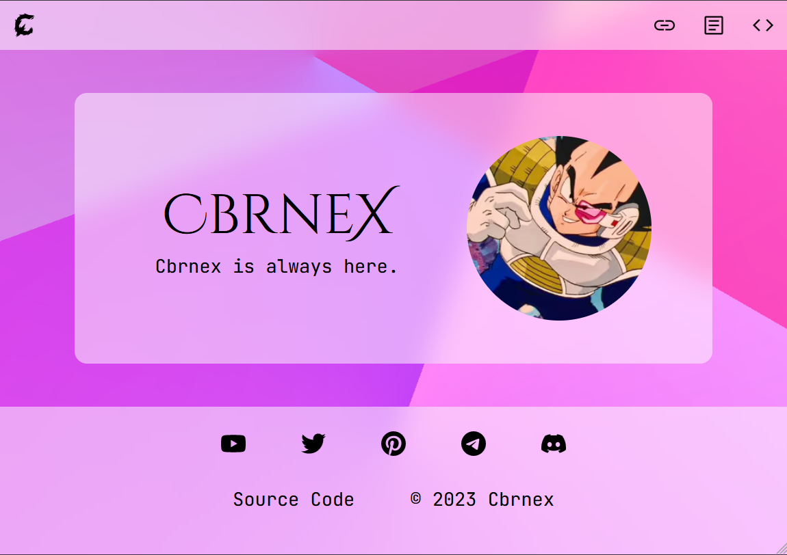
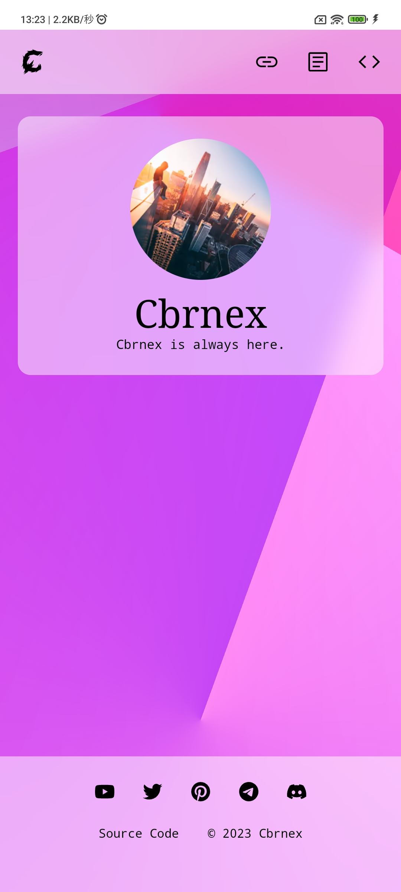

[last-commit-badge]: https://img.shields.io/github/last-commit/7rs/pages?color=green  
[commits-badge]: https://img.shields.io/github/commit-activity/t/7rs/pages?color=green  
[issues-badge]: https://img.shields.io/github/issues/7rs/pages?color=yellow  
[closed-issues-badge]: https://img.shields.io/github/issues-closed/7rs/pages?color=green  
[pr-badge]: https://img.shields.io/github/issues-pr/7rs/pages?color=yellow&label=PR  
[closed-pr-badge]: https://img.shields.io/github/issues-pr-closed/7rs/pages?color=green&label=PR  

[license-badge]: https://img.shields.io/github/license/7rs/pages?color=blue  
[languages-badge]: https://img.shields.io/github/languages/count/7rs/pages?color=blue  
[contributors-badge]: https://img.shields.io/github/contributors/7rs/pages?color=blue  

![][license-badge] ![][languages-badge] ![][contributors-badge] ![][commits-badge] ![][last-commit-badge]  
![][issues-badge] ![][pr-badge] ![][closed-issues-badge] ![][closed-pr-badge]  


# [7rs.dev](https://7rs.dev/)  


<div>
    
    
</div>  

### Modern and simple website.


# Benchmark  

  


# Licence  

Do wtf you wanna use with the favicon and source codes I created.  
If you use content I ain't created, you've to follow its license.  

| License                                                           | Target               |
| ----------------------------------------------------------------- | -------------------- |
| [WTFPL](http://www.wtfpl.net/about/)                              | Source code          |
| [Unsplash License](https://unsplash.com/license)                  | Images from Unsplash |
| [OFL](https://scripts.sil.org/ofl)                                | Google Fonts/Icons   |
| [Apache License 2.0](https://www.apache.org/licenses/LICENSE-2.0) | Google Fonts/Icons   |


# Requirement  

| Package                                                                                                                                             | Version                                              |
| --------------------------------------------------------------------------------------------------------------------------------------------------- | ---------------------------------------------------- |
| [Astro](https://docs.astro.build/ja/guides/upgrade-to/v2/)                                                                                          |  |
| [Node.js](https://nodejs.org/en/download/releases)                                                                                                  |                                                      |
| [Cloudflare Pages (Recommendation)](https://pages.cloudflare.com/)                                                                                  |                                                      |
| [Node version in Cloudflare (How to)](https://developers.cloudflare.com/pages/framework-guides/deploy-a-hexo-site/#using-a-specific-nodejs-version) |                                                      |
| [Porkbun (Recommendation)](https://porkbun.com/)                                                                                                    |                                                      |
| [pnpm (Recommendation)](https://pnpm.io/)                                                                                                           |   |
| [fnm (Recommendation)](https://fnm.vercel.app/)                                                                                                     |                                                      |


# Usage / Installation  
`Require` Screen capture (GIF)  

```bash  
git clone git@github.com:7rs/pages.git  
# HTTPS: git clone https://github.com/7rs/pages.git  
# "--depth 1" option for faster speed  

pnpm install astro  
pnpm run dev  
```  


# Documentation  

| Title/Name | About/Comment |
| ---------- | ------------- |
| [Astro Docs](https://docs.astro.build/en/getting-started/) | Astro |
| [MDN HTML](https://developer.mozilla.org/docs/Web/HTML) | HTML |
| [MDN CSS](https://developer.mozilla.org/docs/Web/CSS) | CSS |
| [MDN JavaScript](https://developer.mozilla.org/docs/Web/JavaScript) | JavaScript |
| [Stylus](https://stylus-lang.com/docs/executable.html) | Stylus |
| [Can I use](https://caniuse.com/) | Support tables |
| [Cloudflare Docs](https://developers.cloudflare.com/pages/) | Cloudflare pages, etc. |
| [Porkbun Knowledge Base](https://kb.porkbun.com/) | Porkbun, etc. |


# Reference / Resource  

| Title/Name                                              | About/Comment |
| ------------------------------------------------------- | ------------- |
| [Material Design Colors](https://materialui.co/colors/) | Good colors   |
| [Google Fonts](https://fonts.google.com/)               | Fonts         |
| [Google Icons](https://fonts.google.com/icons)          | Icons         |
| [Simple Icons](https://simpleicons.org/)                | Brand icons   |
| [Unsplash](https://unsplash.com/)                       | Wallpapers    |


# Contributing  
`Require` Add contributing.md  

Please see our ~~contributing.md~~.  
Plaese use English or Japanese.  


# Author  

- [Cbrnex/7rs](https://github.com/7rs)  


# Tools (recommendation)  

| Name                                                            | About/Comment                                             | Platform           |
| --------------------------------------------------------------- | --------------------------------------------------------- | ------------------ |
| [VSCode (Most used?)](https://code.visualstudio.com/)           | IDE/Editor                                                | X                  |
| [VSCodium](https://vscodium.com/)                               | VSCode without Microsoft. Can't use microsoft extensions. | X                  |
| Atom                                                            | Repository has been archived.                             | X                  |
| [Sublime Text](https://www.sublimetext.com/)                    | Fast Editor                                               | X                  |
| [Neovim](https://neovim.io/)                                    | CUI Editor                                                | CLI                |
| Vim                                                             | built-in?                                                 | CLI                |
| vi                                                              | built-in?                                                 | CLI                |
| [EditorConfig](https://editorconfig.org/)                       | Coding Ruler                                              | X                  |
| [FireFox](https://www.mozilla.org/firefox/browsers/)            | Fast and OSS browser                                      | X                  |
| [Chrome (Most used)](https://www.google.com/intl/en_us/chrome/) | Google's browser                                          | X                  |
| Safari                                                          | built-in                                                  | iOS, iPadOS, MacOS |
| Edge                                                            | built-in                                                  | X                  |
| [Bromite](https://www.bromite.org/)                             | Chromium fork with ad blocking and enhanced privacy       | Android            |
| [Alacritty](https://alacritty.org/)                             | Fast Terminal                                             | X                  |
| [iTerm2](https://iterm2.com/)                                   | Terminal for beginners                                    | MacOS              |
| Terminal.app                                                    | built-in                                                  | MacOS              |
| Powershell                                                      | built-in                                                  | Windows            |
| [Termux](https://termux.dev/en/)                                | Terminal emulator and Linux environment app               | Android            |
| [Fish](https://fishshell.com/)                                  | Fast and awesome shell                                    | CLI                |
| Bash                                                            | built-in (Mac OS, Linux)                                  | CLI                |
| Zsh                                                             | built-in (Mac OS)                                         | CLI                |
| [Starship](https://starship.rs/)                                | Awesome prompt                                            | CLI                |
| [FFmpeg](https://www.ffmpeg.org/)                               | Video editor in CLI (Supports image, audio)               | CLI                |
| [sharp-cli](https://github.com/vseventer/sharp-cli)             | Image compressor                                          | CLI                |
| [Squoosh](https://squoosh.app/)                                 | Webapp. Image Compressor. (no longer actively maintained) | Browser            |


# Other  

- [stackshare](https://stackshare.io/7rs/my-site)  
